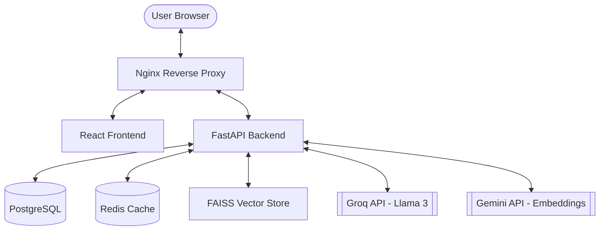

# DocAiApp: AI-Powered Document & Multimedia Q&A

A production-grade full-stack application that leverages Retrieval-Augmented Generation (RAG) to enable interactive Q&A over documents (PDF, DOCX) and multimedia (Video, Audio) with precise timestamp referencing.


## ✨ Features

- **Document Intelligence**: Deep parsing of PDF and DOCX files with structure-aware chunking.
- **Multimedia Q&A**: Support for Video/Audio files with automated transcription and **precise timestamp seeking**.
- **Real-time Streaming**: Chat responses delivered via **Server-Sent Events (SSE)** for a low-latency UI experience.
- **Advanced RAG Pipeline**: Semantic search powered by **FAISS** and Gemini Embeddings (`text-embedding-004`).
- **High-Performance LLM**: Chat generation using **Groq (Llama 3.3)** for near-instantaneous reasoning.
- **Map-Reduce Summarization**: Automated generation of comprehensive summaries for long-form content.
- **Security-First Auth**: JWT-based authentication with **refresh token rotation** and secure password hashing (bcrypt).
- **Production Infrastructure**: Multi-stage Docker builds, Nginx reverse proxy, and health monitoring.

## 🏗️ Architecture



### RAG Pipeline
The application implements a robust Retrieval-Augmented Generation (RAG) flow. Documents are parsed and split into overlapping chunks to maintain context. Each chunk is transformed into a 768-dimensional vector using Google's `text-embedding-004` and stored in a local **FAISS** index. At query time, the system performs a similarity search to retrieve the most relevant context before synthesizing a response via Groq.

### Multimedia Pipeline
Multimedia files (MP4, MP3, etc.) are processed through an extraction layer that isolates audio streams. We utilize OpenAI's **Whisper** (via Groq) with `verbose_json` output to generate word-level transcriptions. This allows the backend to map transcript segments to specific video timestamps, enabling the frontend to "seek" to the exact moment an answer is discussed.

## 🚀 Quick Start

### Prerequisites
- Docker Desktop
- [Gemini API Key](https://aistudio.google.com/)
- [Groq API Key](https://console.groq.com/)

### 3-Step Setup
1. **Clone and Configure**:
   ```bash
   git clone https://github.com/yourusername/docaiapp.git
   cd docaiapp
   cp .env.example .env
   ```
   *Fill in your `GEMINI_API_KEY` and `GROQ_API_KEY` in the `.env` file.*

2. **Launch Stack**:
   ```bash
   docker compose up --build -d
   ```

3. **Access App**:
   Navigate to [http://localhost:3000](http://localhost:3000)

## 📡 API Reference

### Authentication
| Method | Path | Auth | Description |
| :--- | :--- | :--- | :--- |
| POST | `/api/v1/auth/register` | No | Create a new account |
| POST | `/api/v1/auth/login` | No | Obtain Access & Refresh tokens |
| POST | `/api/v1/auth/refresh` | No | Rotate expired access tokens |
| POST | `/api/v1/auth/logout` | Yes | Revoke active session |

### Core Functionality
| Method | Path | Auth | Description |
| :--- | :--- | :--- | :--- |
| POST | `/api/v1/upload` | Yes | Upload file and trigger ingestion |
| GET | `/api/v1/files` | Yes | List all user-owned files |
| GET | `/api/v1/files/:id` | Yes | Get file metadata & status |
| DELETE | `/api/v1/files/:id` | Yes | Delete file and associated vectors |
| POST | `/api/v1/chat` | Yes | Streaming Q&A (SSE) |
| GET | `/api/v1/summary/:id` | Yes | Get auto-generated summary |

## 🧪 Testing

### Backend Tests
We maintain a strict **95% coverage** threshold. All external AI APIs are mocked using `pytest-mock` to ensure deterministic tests and avoid unnecessary API costs during CI.
```bash
cd backend
pytest --cov=app --cov-report=html
```
The coverage report is generated in `backend/coverage_html/`.

### Frontend Tests
Run the Vitest suite for React components and state management hooks:
```bash
cd frontend
npm test -- --coverage --watchAll=false
```

## 🐳 Docker & Deployment

The application uses a dual-compose strategy:
- **`docker-compose.yml`**: Optimized for development with hot-reloading (via volumes) and debug logging.
- **`docker-compose.prod.yml`**: Hardened for production. It swaps the dev server for **Gunicorn/Uvicorn**, enables an Nginx reverse proxy with security headers, and disables debug mode.

**To run in production mode locally:**
```bash
docker compose -f docker-compose.yml -f docker-compose.prod.yml up --build -d
```

## 🔧 Development Setup (Manual)

If you prefer to run services outside of Docker:

**Backend**:
```bash
cd backend
python -m venv venv
source venv/bin/activate  # venv\Scripts\activate on Windows
pip install -e ".[dev]"
alembic upgrade head
uvicorn app.main:app --reload
```

**Frontend**:
```bash
cd frontend
npm install
npm run dev
```
*Note: Requires local instances of PostgreSQL 16 and Redis 7.*

## 📐 Design Decisions

### Why FAISS over Pinecone?
FAISS (Facebook AI Similarity Search) was chosen for its exceptional performance in local environments and zero infrastructure overhead. By using an abstract interface for our vector store, we maintain the flexibility to swap to Pinecone or Milvus as the dataset grows beyond local disk capacity.

### Why SSE over WebSockets?
We utilize **Server-Sent Events (SSE)** for streaming chat responses. Unlike WebSockets, SSE is unidirectional (ideal for LLM streams), automatically handles reconnection, and works seamlessly over standard HTTP/2 without the overhead of maintaining a full-duplex connection.

### Why JWT with Refresh Rotation?
To balance security and UX, we use short-lived access tokens (15m) and long-lived refresh tokens (7d). **Refresh token rotation** is implemented to invalidate old tokens whenever a new one is issued, effectively neutralizing the threat of stolen refresh tokens.

### Why Map-Reduce Summarization?
To handle documents that exceed the LLM's context window, we implement a map-reduce strategy. We summarize individual chunks ("map") and then synthesize those summaries into a final coherent document ("reduce"), ensuring consistent quality regardless of file size.

### Why verbose_json for Whisper?
By requesting `verbose_json` from the transcription engine, we capture word-level timestamps. This metadata is the cornerstone of our "timestamp seeking" feature, allowing us to link specific chat answers to exact seconds in the source multimedia.

## 🗂️ Project Structure

```text
├── backend/
│   ├── app/            # FastAPI source code
│   ├── alembic/        # Database migrations
│   ├── tests/          # Pytest suite
│   └── Dockerfile      # Multi-stage Python build
├── frontend/
│   ├── src/            # React + TypeScript source
│   ├── tests/          # Vitest suite
│   └── Dockerfile      # Node + Nginx build
├── nginx/
│   └── default.conf    # Production reverse proxy config
└── docker-compose.yml  # Orchestration manifest
```

## 🚧 Limitations & Roadmap
- **Current**: Vector indices are stored on disk (FAISS) and are not shared across horizontal backend shards.
- **Current**: Single-user focus (no real-time collaboration on documents).
- **Roadmap**: Migration to a managed vector database (Pinecone) for multi-node scaling.
- **Roadmap**: Support for multi-lingual transcription and cross-file document comparison.

## License
Distributed under the MIT License. See `LICENSE` for more information.
